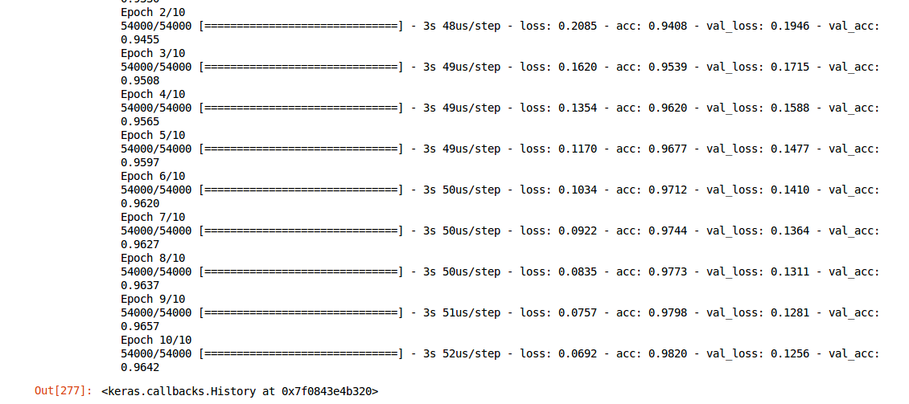
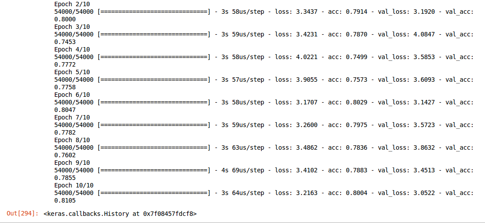
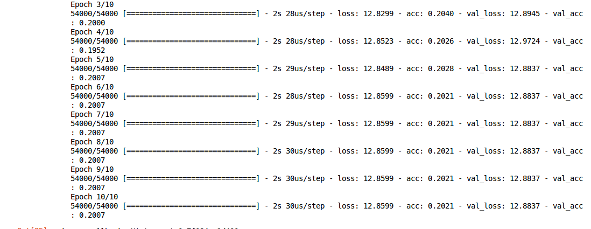
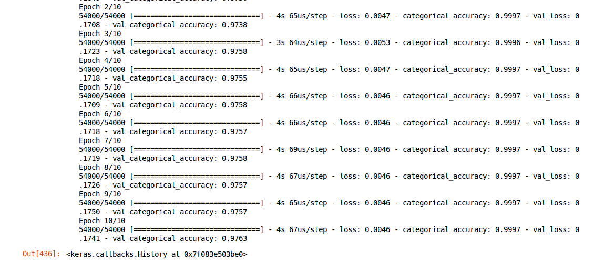

# Image Processing


##  Numerical examples

We have chosen the two following numerical examples :
- Numerical example of forward/backward propagation
- Visualization of weights in a fully-trained convolutional neural network


## Numerical example of forward/backward propagation

### Network description
For our example we chose to train on RGB colors, and predict if the written color above them should be black or white. The inputs numbers between 0 and 255. We normalize them before doing the forward and backward propagation. The output is the probability that the written color over the given RGB color (as input) should be black or white.
We have chosen the following conventions :
- 1 corresponds to white
- 0 corresponds to black

Let's take an example of a _fully-connected neural network_ with **2 hidden layers**, **1 input layer** and **1 output layer** . The input layer has 3 inputs. The first hidden layer has 5 neurons and the second hidden layer 2 neurons. Eventually the output layer has one output.


_<center>Figure 1</center>_

Here are the corresponding weights matrices :

$W^{1} = \begin{bmatrix}w^{1}_{11} & w^{1}_{21} & w^{1}_{31} & w_{0} \\w^{1}_{12} & w^{1}_{22} & w^{1}_{32} & w_{0}\\ w^{1}_{13} & w^{1}_{23} & w^{1}_{33} & w_{0} \\ w^{1}_{14} & w^{1}_{24} & w^{1}_{34} & w_{0} \\ w^{1}_{15} & w^{1}_{25} & w^{1}_{35} & w_{0} \end{bmatrix}$

$W^{2} = \begin{bmatrix}w^{2}_{11} & w^{2}_{21} & w^{2}_{31} & w^{2}_{41} & w^{2}_{51} & w_{1}\\ w^{2}_{12} & w^{2}_{22} & w^{2}_{32} & w^{2}_{42} & w^{2}_{52} & w_{1}\ \end{bmatrix}$

$W^{3} = \begin{bmatrix} w^{3}_{11} & w^{3}_{21} & w_{2} \end{bmatrix}$

Where $w^{k}_{ij}$ corresponds to the weight from neuron $i$ of layer $k$ to neuron $j$ of layer $k+1$.

We have 4 layers, then we have 3 weights matrices.

$W^{1}$ : between input layer and first hidden layer, with the bias of the input layer : $w_{0}$.

$W^{2}$ : between first hidden layer and second hidden layer, with the bias of the first hidden layer : $w_{1}$.

$W^{3}$ : between second hidden layer and output layer, with the bias of the second hidden layer : $w_{2}$.

### Prerequisites

To implement both the forward propagation and the backward propagation, we need some prerequisites.

First of all, we have to consider the `data`. We have the following normalized RGB colors :

```python
# input normalized RGB colors


```

Each input color can be written as : $INPUT = [input_{1}, input_{2}, input_{3} ...]$. With $input_{i} = [input^{i}_{1}, input^{i}_{2}, input^{i}_{3}]$, with $i$ the number of inputs. Then $INPUT$ is a $3*i$ matrix which columns correspond to each input.

As the `expected output` we have the following target probabilities :

```python
# expected output


```

The forward propagation compute the weighted sum for each layer, for the initialized random weights and the input for each layer.

For `weight initialization`, we use random values from _normal distribution_. (We use NumPy to make life easier 👌):

```python
for (layer1, layer2) in zip(layer[:-1],layer[1:]):
  self.weights.append(np.random.normal(scale=0.15,size =(layer2, layer1+1)))
```

Note that here we add a dimension in order to add the bias for each layer. The bias is stored at the end of the weights vector.

By computing the weighted sum, the obtained values have a range from minus infinity to infinity... That is why we are using one function to range them between 0 and 1. This function is called the activation function.
We chose to use only the sigmoid function as activation function since its derivative is easy to get :

```python
  def sigmoid(self, beforeAct, derivative = False):
   #activation function
    #sigmoid function
    if not derivative:
      return 1/(1+np.exp(-beforeAct))
     else:
      #derivative formula
      output = self.sigmoid(beforeAct)
    return output*(1 - output)))
```

Note that the boolean here is used to get the derivative when needed.
We then have successively output values from the weighted sum which are, after the activate those values, the input for the next layer. Eventually, we obtain an output for each input (example) from the input data.

Those first values should not be really good. That is why we are going to train our model, by modifying the weights according to each layer output. This is the backward propagation.


### Forward propagation

The principle of forward propagation is the following :
- Step 1 : compute the weighted sum with the input data
- Step 2 : apply the activation function to the previous result
- Step 3 : compute the weighted sum for the following layer with ouput of the first (or previous) layer as an input (Step 3 (a)) and apply the activation function (Step 3 (b))
- Step 4 : eventually, apply the steps 3 (a) and (b) for all the network's layers.
- Step 5 : the result of the forward propagation is the final output for the last layer

As said previously, we have three weights matrices : $W^{1}$, $W^{2}$, $W^{3}$, and the $INPUT$ matrix. To simplify and understand better the calculations, **we consider only 3 inputs, ie: matrix with $i=3$, ie: $3*3$ matrix**.

$INPUT = \begin{bmatrix} input^{1}_{1} & input^{1}_{2} & input^{1}_{3} \\ input^{2}_{1} & input^{2}_{2} & input^{2}_{3} \\  input^{3}_{1} & input^{3}_{2} & input^{3}_{3}\end{bmatrix}^{T}$

Let's introduce now three other vectors : $Z^{1}$, $Z^{2}$, $Z^{3}$, for the first hidden layer, the second and the output layer. Each of them are composed of column vectors which correspond to each input (here we have 3 columns then). The value of each vector's coefficient is the weighted sum corresponding of each neuron of the layer.

Let's introduce as well, $A^{1}$, $A^{2}$, $A^{3}$, which are the same matrices as $Z^{1}$, $Z^{2}$, $Z^{3}$, but after applying the activation function. Then :
- $A^{1}$ is both the output of the first hidden layer and the input of the second hidden layer ($5*3$ matrix)
- $A^{2}$ is both the output of the second hidden layer and the input of the last layer (output layer) ($2*3$ matrix)
- $A^{3}$ is the output of the last layer, ie: output of the network forward propagation. ($1*3$ matrix)


Step 1 consists of computing the following formulas :
$Z^{1} = [z^{1}_{1}, z^{1}_{2}, z^{1}_{3}]$

$z^{1}_{1} = \sum^{3}_{i=1}{w^{1}_{i1} input_{i1}} + w_{0}$

$z^{1}_{1} = \begin{bmatrix} z^{1}_{11} \\ z^{1}_{12} \\ z^{1}_{13} \\ z^{1}_{14} \\ z^{1}_{15} \end{bmatrix}$

with :

$z^{1}_{11} = \sum^{3}_{i=1}{w^{1}_{i1} input^{1}_{i}} + w_{0}$

$z^{1}_{12} = \sum^{3}_{i=1}{w^{1}_{i2} input^{1}_{i}} + w_{0}$

$z^{1}_{13} = \sum^{3}_{i=1}{w^{1}_{i3} input^{1}_{i}} + w_{0}$

$z^{1}_{14} = \sum^{3}_{i=1}{w^{1}_{i4} input^{1}_{i}} + w_{0}$

$z^{1}_{15} = \sum^{3}_{i=1}{w^{1}_{i5} input^{1}_{i}} + w_{0}$


This can also be written as : $Z^{1} = W^{1} . [INPUT, 1]^{T}$ ($5*3$ matrix)

Step 2 consists of computing : $A^{1} = [a^{1}_{1}, a^{1}_{2}, a^{1}_{3}, a^{1}_{4}, a^{1}_{5}]$, by applying the activation function (here the sigmoid function) to the previous computed vector $Z^{1}$ :

$a^{1}_{1} = sigmoid(z^{1}_{1})$

$a^{1}_{2} = sigmoid(z^{1}_{2})$

$a^{1}_{3} = sigmoid(z^{1}_{3})$

$a^{1}_{4} = sigmoid(z^{1}_{4})$

$a^{1}_{5} = sigmoid(z^{1}_{5})$

This can also be written as : $A^{1} = sigmoid(Z^{1})$.

Then, we continue this reasoning (step 3 and step 4), for the second hidden layer and the last layer.

$Z^{2} = W^{2} . \begin{bmatrix}  & A^{1} \\ 1 & 1 & 1 \end{bmatrix}$ (result : $2*3$ matrix)

$A^{2} = sigmoid(Z^{2})$ ($2*3$ matrix)

$Z^{3} = W^{3} . \begin{bmatrix}  & A^{2} \\ 1 & 1 & 1 \end{bmatrix}$ (result : $1*3$ matrix)

$A^{3} = sigmoid(Z^{3})$ ($1*3$ matrix, ie: one probability for each input)


In our code we have to consider all the layers (using of `for loop` for Step 4), and we distinguish two cases:
- Step 1 is done if we are considering our first layer
- Step 3 (a) is done for all other layers

We then do the previous enonced steps :
- Step 2 and Step 3 (b) are done by taking the sigmoid of the previous results for each layer (last line of `for loop`)
- Step 5 : we return the last computed output (that is to say the one for the last layer)


Here is our `final forward propagation` code : 
```python
def forwardPropagation(self, input):
  number_of_input = input.shape[0]
  self._layer_input = []
  self._layer_output = []
  for i in range(self.layer_count):
    if i == 0:
      layerinput = self.weights[0].dot(np.vstack([input.T, np.ones([1,number_of_input])]))

    else:

      layerinput = self.weights[i].dot(np.vstack([self._layer_output[-1], np.ones([1,number_of_input])]))
      self._layer_input.append(layerinput)
      
  self._layer_output.append(self.sigmoid(layerinput))

  return self._layer_output[-1].T
```

### Backward propagation

To perform forward propagation result we have to go through the network and do back propagation. "back" term stands for the fact that we will begin from the last layer (output layer) to the first layer (input layer). While propagate, we compute gradients and update weights. After each forward propagation, the error can be calculated from the output layer : **error = output - expected_output**. The first step of backward propagation is to compute the derivative of the total error with respect to each weights which contribute to change this error. From this first derivative we will compute an other one again and again. That is why we can see from backward propagation that the error is distributed back through the network layer. Thus, the main goal of backpropagation is to update weights in order to decrease the total error of the next forward propagation.

In other words, we want to know how much a change in $w^{3}_{1}$ or $w^{3}_{2}$ affects the total error. In mathematical words, this corresponds to : 

$\frac{\partial{Error_{total}}}{\partial{w^{3}_{1}}}$
and
$\frac{\partial{Error_{total}}}{\partial{w^{3}_{2}}}$

Thanks to the chain rule, and with respect to the first input, we have :
$\frac{\partial{Error_{total}}}{\partial{w^{3}_{11}}} = \frac{\partial{Error_{total}}}{\partial{a^{2}_{1}}} . \frac{\partial{a^{2}_{1}}}{\partial{z^{2}_{1}}} . \frac{\partial{z^{2}_{1}}}{\partial{w^{3}_{11}}}$


Here is our `final backward propagation` code : 
```python
def backpropagation(self, input, output, learning_rate = 0.2):
  len_input = input.shape[0]
  fwd_prog = self.forwardPropagation(input)
  delta = []


  for i in reversed(range(self.layer_count)):

    if i == self.layer_count -1:
      diff = self._layer_output[i] - output.T

      error = np.sum(diff**2)

      delta_k = diff * (self.sigmoid(self._layer_input[i], True))

      delta.append(delta_k)

    else:
      delta_j = self.weights[i+1].T.dot(delta[-1])
      delta.append(delta_j[:-1,:] * self.sigmoid(self._layer_input[i], True))


  for i in range(self.layer_count):
    delta_i = self.layer_count -1 - i

    if i == 0:
      layeroutput = np.vstack([input.T, np.ones([1, len_input])])

    else:
      layeroutput = np.vstack([self._layer_output[i-1], np.ones([1, self._layer_output[i-1].shape[1]])])

      weight_delta = np.sum(layeroutput[None,:,:].transpose(2,0,1) * delta[delta_i][None,:,:].transpose(2,1,0), axis=0)

     self.weights[i] -= learning_rate * weight_delta


  return error
```


## DATA ANALYSIS


How many examples do I have in my dataset?
--> 70000 (60000 training + 10000 test)
What is the shape of my input images?
--> 28*28 of grayscale imaging
How many classes do I have?
10 classes
What is the class distribution in my dataset?
--> code
Is the testing set similar to the training set?
--> yes, also grayscale imaging, same dimension ...

softmax regression

https://dzone.com/articles/exploring-handwritten-digit-classification-a-tidy
Exploring pixel data:
  - How much gray is there in the set of images?
  - Average of the images
  - Which digits have more variability on average?
  - Find the images which are the least similar to the average, and nearest
  - Pixels that distinguish pairs of images


## Data pre-processing

### Loss function
To compile a model we have to use a loss function that returns a scalar for each data-point. This loss function takes two arguments : true labels and predictions. It measures the performance of a classification model whose output is a probability value between 0 and 1.

#### Cross entropy
Cross entropy loss could also be called log loss. If the predicted probability diverges from the actual observation label, cross entropy increases. Then a perfect model, which means that the predicted probability is 1, would have a cross entropy loss of 0 (log loss : log(1) = 0).


_<center>Figure 2</center>_

From this figure, one can see that as predicted probability decreases log loss increases rapidely and, however, as predicted probability increases log loss decreases slowly.


#### Sparse cross entropy

### Different optimization algorithm
Optimization algorithms help us to minimize (or maximize) the error function, which is our most important objective while doing back propagation. This function depends on the learnable parameters of the network : the weights and the bias.
#### Standard stochastic Gradient Descent (SGD)


_<center>Figure 3</center>_

learning rate = 0.05  batch size = 128
#### Adam optimizer
learning_rate = 0.05 batch size = 128



_<center>Figure 3</center>_
#### RMSProp optimizer



_<center>Figure 4</center>_
#### Nesterov Adam optimizer

```python
model.compile(loss=keras.losses.categorical_crossentropy,
            optimizer=keras.optimizers.Nadam(learning_rate),
              metrics=['categorical_accuracy'])
```


_<center>Figure 5</center>_


### Metrics
When a model is compiled, we can put a special metric function which will judge the performance of the model.
#### Categorical accuracy
#### Sparse categorical accuracy
batch_size=128
learning_rate = 0.05

```python
#model.compile(loss=keras.losses.sparse_categorical_crossentropy,
 #           optimizer=keras.optimizers.Adam(learning_rate),
  #            metrics=['accuracy'])


learning_rate = 0.15
model.compile(loss=keras.losses.sparse_categorical_crossentropy,
             optimizer=keras.optimizers.SGD(lr=learning_rate),
              metrics=['sparse_categorical_accuracy'])

learning_rate = 0.15
model.compile(loss=keras.losses.sparse_categorical_crossentropy,
             optimizer=keras.optimizers.SGD(lr=learning_rate),
              metrics=['categorical_accuracy'])

```
sparse_sparse_acc.png
+
sparse_without_sparse_acc.png


#### Top k categorical accuracy

## Model construction

### Implementation of the given network


model.add(Dense(50, activation = "relu"))
model.add(Dense(50, activation = "relu"))

learning_rate = 0.0003
#model.compile(loss=keras.losses.sparse_categorical_crossentropy,
 #           optimizer=keras.optimizers.SGD(lr=learning_rate),
  #            metrics=['sparse_categorical_accuracy'])

model.compile(loss=keras.losses.categorical_crossentropy,
            optimizer=keras.optimizers.Nadam(learning_rate),
              metrics=['accuracy'])
