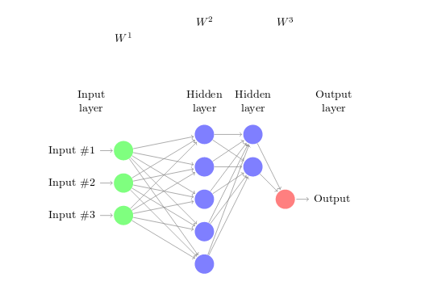

# Image Processing

---
##  Numerical examples

We have chosen the two following numerical examples :
- Numerical example of forward/backward propagation
- Visualization of weights in a fully-trained convolutional neural network
### Example 1.) Numerical example of forward/backward propagation

#### Network description

Given a _fully-connected neural network_  with **2 hidden layers**, **1 input layer** and **1 output layer**. The input layer has 3 inputs. The first hidden layer has 5 neurons and the second hidden layer 2 neurons. Eventually the output layer has one output. The network is shown on _Figure 1_ below:



_<center>Figure 1</center>_

For the given network, we choose to create a model that takes in an RGB color, and predicts if the written color above it should be black or white to be easily readable. The inputs are RGB color values, eg.: vectors of length of 3, where each value is a number from 0 to 255. The values are normalised (eg.: simply divided by 255 in this case) before doing the forward and backward propagation to make the model more reliable. The output of this model is a number between 0 and 1. It represents a probability if the written color over the given input color should be white.
We chose the following conventions:
- 1 corresponds to white
- 0 corresponds to black

Meaning, that if the model outputs a near 1 value, the text above the input color should be white, if it is near 0, it should be black.


Here are the corresponding weight matrices for this network:

$W^{1} = \begin{bmatrix}w^{1}_{11} & w^{1}_{21} & w^{1}_{31} & w_{0} \\w^{1}_{12} & w^{1}_{22} & w^{1}_{32} & w_{0}\\ w^{1}_{13} & w^{1}_{23} & w^{1}_{33} & w_{0} \\ w^{1}_{14} & w^{1}_{24} & w^{1}_{34} & w_{0} \\ w^{1}_{15} & w^{1}_{25} & w^{1}_{35} & w_{0} \end{bmatrix}$

$W^{2} = \begin{bmatrix}w^{2}_{11} & w^{2}_{21} & w^{2}_{31} & w^{2}_{41} & w^{2}_{51} & w_{1}\\ w^{2}_{12} & w^{2}_{22} & w^{2}_{32} & w^{2}_{42} & w^{2}_{52} & w_{1}\ \end{bmatrix}$

$W^{3} = \begin{bmatrix} w^{3}_{11} & w^{3}_{21} & w_{2} \end{bmatrix}$

Where $w^{k}_{ij}$ corresponds to the weight from neuron $i$ of layer $k$ to neuron $j$ of layer $k+1$.

Since we have 4 layers, we will have 3 weight matrices.

$W^{1}$ : between the input layer and the first hidden layer, with the bias of the input layer : $w_{0}$.

$W^{2}$ : between the first hidden layer and the second hidden layer, with the bias of the first hidden layer : $w_{1}$.

$W^{3}$ : between the second hidden layer and the output layer, with the bias of the second hidden layer : $w_{2}$.

#### Prerequisites
We decided to implement this network in Python. To implement both the forward and the backward propagation, we have to decide about a few things.

First of all, we have to consider the `input`:

```python
  input = [
    [0,1,0], # pure green
    [0,1,1],
    [1,0,0], # pure red
    [0.95294118,0.99607843,0.99607843],
    [0.93333333,0.93333333,0.93333333],
    [0.90588235,0.65098039,0.80392157],
    [0,0,0], # pure black
    [0.87058824,0.87058824,0.80392157],
    [0.26666667,0.26666667,0.93333333],
    [0.92941176,0.88627451,0.0745098 ]
  ]
```

$INPUT = [input_{1}, input_{2}, input_{3}, ..., input_{i}]$,
Where ${i}$ is the number of inputs.
An arbitrary $INPUT_{j} = $ $[input_{j}^{R}, input_{j}^{G}, input_{j}^{B}]$, where ${R}, {G}$ and ${B}$ are the normalised color values. Thus a single input is a vector of length ${3}$.

As the `expected output` we have the following array, where each value represents either black or white to the corresponding `input` value at the same index:

```python
  expected_output = [1,1,0,0,0,0,1,0,1,0]
```

We compute the weighted sum of all the inputs of each neuron, at every layer. The weights are initialized randomly. 
In our code, for `weight initialization`, we use random values from _normal distribution_. (We use NumPy to make life easier 👌):

```python
for (layer1, layer2) in zip(layer[:-1],layer[1:]):
  self.weights.append(np.random.normal(scale=0.15,size =(layer2, layer1+1)))
```

Note that here we add a dimension in order to add the bias for each layer. The bias is stored at the end of the weight vectors.

By computing the weighted sum, the obtained values have a range from minus infinity to infinity... That is why we are using one function to range them between 0 and 1. This function is called the **activation function**.
We chose *sigmoid* as our only activation function since its derivative is easy to get :

```python
def sigmoid(self, beforeAct, derivative = False):
#activation function
    #sigmoid function
    if not derivative:
        return 1/(1+np.exp(-beforeAct))
    else:
        #derivative formula
        output = self.sigmoid(beforeAct)
        return output*(1 - output)
```

Note that the boolean here is used to get the derivative when needed.
We then have successively output values from the weighted sum which are - after the activate those values - the input for the next layer. Eventually, we obtain an output for each input (example) from the input data.

#### Forward propagation

The principle of forward propagation is the following :
1. compute the weighted sum of the first hidden layer's neurons from the input data
2. apply the activation function to the previous result
3. 
   a) compute the weighted sum from the previous layer as the input
   b) apply the activation function and output the result to the next layer
4. repeat 3a and 3b until the last layer has been reached
5. the result of the forward propagation is the last hidden layer's output, also called the output layer

As said previously, we have three weight matrices : $W^{1}$, $W^{2}$, $W^{3}$, and the $INPUT$ matrix. To simplify and understand the calculations better, **let us consider only 3 inputs**, ie: matrix with $i=3$, ie: $3*3$ matrix.

$INPUT = \begin{bmatrix} input^{1}_{1} & input^{1}_{2} & input^{1}_{3} \\ input^{2}_{1} & input^{2}_{2} & input^{2}_{3} \\  input^{3}_{1} & input^{3}_{2} & input^{3}_{3}\end{bmatrix}^{T}$

Let's now introduce three more vectors : $Z^{1}$, $Z^{2}$, $Z^{3}$, for each hidden layer (including the output layer). Each of them are composed of column vectors which correspond to each input (here we have 3 columns then). The value of each vector's coefficient is the weighted sum corresponding of each neuron of the layer.

Let's introduce as well, $A^{1}$, $A^{2}$, $A^{3}$, which are the same matrices as $Z^{1}$, $Z^{2}$, $Z^{3}$, but after applying the activation function. Then :
- $A^{1}$ is both the output of the first hidden layer and the input of the second hidden layer ($5*3$ matrix)
- $A^{2}$ is both the output of the second hidden layer and the input of the last layer (output layer) ($2*3$ matrix)
- $A^{3}$ is the output of the last layer, ie: output of the network forward propagation. ($1*3$ matrix)


Step 1 consists of computing the following formulas :
$Z^{1} = [z^{1}_{1}, z^{1}_{2}, z^{1}_{3}]$

$z^{1}_{1} = \sum^{3}_{i=1}{w^{1}_{i1} input_{i1}} + w_{0}$

$z^{1}_{1} = \begin{bmatrix} z^{1}_{11} \\ z^{1}_{12} \\ z^{1}_{13} \\ z^{1}_{14} \\ z^{1}_{15} \end{bmatrix}$

with :

$z^{1}_{11} = \sum^{3}_{i=1}{w^{1}_{i1} input^{1}_{i}} + w_{0}$

$z^{1}_{12} = \sum^{3}_{i=1}{w^{1}_{i2} input^{1}_{i}} + w_{0}$

$z^{1}_{13} = \sum^{3}_{i=1}{w^{1}_{i3} input^{1}_{i}} + w_{0}$

$z^{1}_{14} = \sum^{3}_{i=1}{w^{1}_{i4} input^{1}_{i}} + w_{0}$

$z^{1}_{15} = \sum^{3}_{i=1}{w^{1}_{i5} input^{1}_{i}} + w_{0}$


This can also be written as : $Z^{1} = W^{1} . [INPUT, 1]^{T}$ ($5*3$ matrix)

Step 2 consists of computing : $A^{1} = [a^{1}_{1}, a^{1}_{2}, a^{1}_{3}, a^{1}_{4}, a^{1}_{5}]$, by applying the activation function (here the sigmoid function) to the previous computed vector $Z^{1}$ :

$a^{1}_{1} = sigmoid(z^{1}_{1})$

$a^{1}_{2} = sigmoid(z^{1}_{2})$

$a^{1}_{3} = sigmoid(z^{1}_{3})$

$a^{1}_{4} = sigmoid(z^{1}_{4})$

$a^{1}_{5} = sigmoid(z^{1}_{5})$

This can also be written as : $A^{1} = sigmoid(Z^{1})$.

Then, we continue this reasoning (step 3 and step 4), for the second hidden layer and the last layer.

$Z^{2} = W^{2} . \begin{bmatrix}  & A^{1} \\ 1 & 1 & 1 \end{bmatrix}$ (result : $2*3$ matrix)

$A^{2} = sigmoid(Z^{2})$ ($2*3$ matrix)

$Z^{3} = W^{3} . \begin{bmatrix}  & A^{2} \\ 1 & 1 & 1 \end{bmatrix}$ (result : $1*3$ matrix)

$A^{3} = sigmoid(Z^{3})$ ($1*3$ matrix, ie: one probability for each input)


In our code we have to consider all the layers (using of `for loop` for Step 4), and we distinguish two cases:
- Step 1 is done if we are considering our first layer
- Step 3 (a) is done for all other layers

<!-- REVIEW: enonced? -->
We then do those steps :
- Step 2 and Step 3 (b) are done by taking the sigmoid of the previous results for each layer (last line of `for loop`)
- Step 5 : we return the last computed output (that is to say the one for the last layer)


Here is our `final forward propagation` code : 
```python
    def forwardPropagation(self, input):
        number_of_input = input.shape[0]
        self._layer_input = []
        self._layer_output = []
        for i in range(self.layer_count):
            #if 1st layer (input layer)
            if i == 0:
                #self.weights[0] : weights between the first and the second (hidden) layer
                #product between the corresponding weights and the transposed input matrix
                #adding ones vector : for the bias addition after the weighted sum
                layerinput = self.weights[0].dot(np.vstack([input.T, np.ones([1,number_of_input])]))

            else:
                #same with taking the output of the previous layer (-1 takes the last one)
                #each time we will have a output vector for each input (ones of size of number of inputs)

                layerinput = self.weights[i].dot(np.vstack([self._layer_output[-1], np.ones([1,number_of_input])]))
            #storing the layer input (vector because for each neuron): before activation
            self._layer_input.append(layerinput)
            #storing the output for each neuron (after activation --> sigmoid)
            self._layer_output.append(self.sigmoid(layerinput))

        return self._layer_output[-1].T
```

The very first results should not be very good. That is why we have to train our model, by modifying the weights according to each layer's output in each run. This is where backward propagation comes into the picture.

#### Backward propagation

 The term "back"  stands for the fact that we are going to begin at the last (output) layer and go towards the first (input) layer. While propagating, we compute gradients and update weights. After each forward propagation, the error can be calculated from the output layer : **error = output - expected_output**. The first step of backward propagation is to compute the derivative of the total error with respect to each weights which contribute to change this error.
 From this first derivative we will compute an other one again and again. That is why we can see from backward propagation that the error is distributed back through the network layer. 
 Thus, the main goal of backpropagation is to update weights in order to decrease the total error of the next forward propagation.

In other words, we want to know how much a change in $w^{3}_{1}$ or $w^{3}_{2}$ affects the total error. In mathematical words, this corresponds to : 

$\frac{\partial{Error_{total}}}{\partial{w^{3}_{1}}}$

and

$\frac{\partial{Error_{total}}}{\partial{w^{3}_{2}}}$

Thanks to the chain rule, and with respect to the first input, we have :

$$\frac{\partial{Error_{total}}}{\partial{w^{3}_{1}}} = \frac{\partial{Error_{total}}}{\partial{a^{3}}} . \frac{\partial{a^{3}}}{\partial{z^{3}}} . \frac{\partial{z^{3}}}{\partial{w^{3}_{1}}}$$

By using the squared error we have :

$Error_{total} = \frac{1}{2}.(expectedOutput - Output)^2$

To know how much the total error change with respect to the output we have to compute : $\frac{\partial{Error_{total}}}{\partial{a^{3}}}$ : 

$\frac{\partial{Error_{total}}}{\partial{a^{3}}} = 2.\frac{1}{2}.(-1).(expectedOutput - Output)^{2-1} = (Output - expectedOutput)$

Now, how much does the Output change with respect to its input (ie: before activation : $z^{2}_{1}$). This is here where the derivative of the sigmoid function is used. Thus :
$\frac{\partial{a^{3}}}{\partial{z^{3}}} = sigmoid(z^{3}).(1 - sigmoid(z^{3})) = a^{3} . (1 - a^{3})$

Eventually, $\frac{\partial{z^{3}}}{\partial{w^{3}_{1}}}$ symbolizes the impact of the change of the weight $w^{3}_{1}$ on the weighted sum $z^{3}$.

$z^{3} = w^{3}_{1} . a^{2}_1 + w^3_2 . a^2_2 + w_1.1$

Thus,
$\frac{\partial{z^{3}}}{\partial{w^{3}_{1}}} = a^{2}_1 + 0 + 0$

Combining all together we have :

$$\frac{\partial{Error_{total}}}{\partial{w^{3}_{1}}} = (Output - expectedOutput) . (a^{3} . (1 - a^{3})) . a^{2}_1$$

To simplify, let's define $\delta_0$ as :
$\delta_0 = \frac{\partial{Error_{total}}}{\partial{a^{3}}} . \frac{\partial{a^{3}}}{\partial{z^{3}}}$

Then

$$\frac{\partial{Error_{total}}}{\partial{w^{3}_{1}}} = \delta_0 . a^{2}_1$$


In a similar way we can obtain :

$$\frac{\partial{Error_{total}}}{\partial{w^{3}_{1}}} = \delta_0 . a^{2}_2$$

Since : $\frac{\partial{z^{3}}}{\partial{w^{3}_{2}}} = 0 + a^{2}_2 + 0$

The above calculations correspond to $if$ $i == self.layerCount -1$ in the final code. That is to say, we apply those formulas in case we are in the output layer.

For other layers (previous layers: hidden layers and input layer), the chain rule continue.
Let's have a look on how much a change of weights involve in the first neuron of the second hidden layer impacts the total error. We can apply the reasoning to $w^{2}_{11}$.

$\frac{\partial{Error_{total}}}{\partial{w^{2}_{11}}} = \frac{\partial{Error_{total}}}{\partial{a^{3}}} . \frac{\partial{a^{3}}}{\partial{z^{3}}} . \frac{\partial{z^{3}}}{\partial{a^{2}_1}} . \frac{\partial{a^{2}_1}}{\partial{z^2_1}}. \frac{\partial{z^2_1}}{\partial{w^{2}_{11}}}$

$\frac{\partial{z^{3}}}{\partial{a^{2}_1}} = w^3_1$

$\frac{\partial{a^{2}_1}}{\partial{z^2_1}} = a^{2}_1 . (1 - a^{2}_1)$

As $z^2_1 = w^{2}_{11} . a^{1}_1 + w^{2}_{21} . a^{1}_2 + w^{2}_{31} . a^{1}_3 + w^{2}_{41} . a^{1}_4 + w^{2}_{51} . a^{1}_5 + w_1 . 1$, we have : $\frac{\partial{z^2_1}}{\partial{w^{2}_{11}}} = a^{1}_1$.

Thus :

$$\frac{\partial{Error_{total}}}{\partial{w^{2}_{11}}} = \delta_0 . w^3_1 . (a^{2}_1 . (1 - a^{2}_1)) . a^{1}_1$$

For all remaining weights of $W^2$ we can apply the same reasoning.

But now comes a more interesting computation of the chain rule.
Let's compute the impact of a change of $w^1_{11}$ : $\frac{\partial{Error_{total}}}{\partial{w^{1}_{11}}}$.

A change in this weight $w^1_{11}$ will affect the first neuron of the first hidden layer for sure, ie: $a^1_1$. Since the latter takes part in the computation of both $z^2_1$ (and inderictely $a^{2}_1$) and $z^2_2$ (then affects $a^{2}_2$) in the second hidden layer, our calculations will slightly change by letting appear sum of derivatives.

The same reasoning can be applied to all the weights of the first hidden layer.

$$\frac{\partial{Error_{total}}}{\partial{w^{1}_{11}}} = \frac{\partial{Error_{total}}}{\partial{a^{1}_1}} . \frac{\partial{a^1_1}}{\partial{z^1_1}} . \frac{\partial{z^1_1}}{\partial{w^1_{11}}}$$
$$= (\delta_0 . \frac{\partial{z^3}}{\partial{a^{2}_1}} . \frac{\partial{a^{2}_1}}{\partial{z^2_1}} . \frac{\partial{z^2_1}}{\partial{a^1_1}} + \delta_0 . \frac{\partial{z^3}}{\partial{a^{2}_2}} .  \frac{\partial{a^{2}_2}}{\partial{z^2_2}} . \frac{\partial{z^{2}_2}}{\partial{a^1_1}} ) . \frac{\partial{a^1_1}}{\partial{z^{1}_{1}}} . \frac{\partial{z^1_1}}{\partial{w^{1}_{1}}}$$

Eventually, we have, for any weight $w$, the ratio which tell us how a small change of $w$ will affect the total error : $\frac{\partial{Error_{total}}}{\partial{w}}$.
While propagating through the layers we then can update the weights as following :

$$w_{new} = w_{old} - learningRate . \frac{\partial{Error_{total}}}{\partial{w_{old}}}$$

$w_{old}$ comes first from the random weights initialization, and then from the updated weight at each backward propagation (since the forward propagation does not affect weights).


Here is our `final backward propagation` code : 
```python
def backpropagation(self, input, output, learning_rate = 0.2):
        len_input = input.shape[0]
        #we need the ouput --> forward propagation
        fwd_prog = self.forwardPropagation(input)
        #delta calculation
        delta = []
        #we are going from the end to the beginning of the neural network
        for i in reversed(range(self.layer_count)):
            #for the penultimate layer
            if i == self.layer_count -1:
                #obtained output from forward propagation minus expected output
                #output is stored in columns vectors --> transpose of the expected output
                diff = self._layer_output[i] - output.T
                #total squared error
                error = np.sum(diff**2)
                #difference times the derivative of pre activation value of the layer
                #-->delta for the output layer
                delta_k = diff * (self.sigmoid(self._layer_input[i], True))
                #print(delta_k)
                #storing of delta_k
                delta.append(delta_k)
            else:
                #hidden layer needs the product of the previous layer’s delta
                #with the previous layer’s weights (previous which is actually the next one in fw)
                #chain rule : to obtain the derivative in function of a weight
                #we have to multiply previous delta and
                #d(inputvalue before activation)/d(weight) = weight
                delta_j = self.weights[i+1].T.dot(delta[-1])
                #without the last line which corresponds to the bias
                #sigmoid derivative corresponds to:
                #d(outputHiddenLayer)/d(inputHiddenLayer) =
                #d(outputAfterActivation)/d(inputBeforeActivation)
                #--> product with the gradient of the act function evaluated at the current layer
                delta.append(delta_j[:-1,:] * self.sigmoid(self._layer_input[i], True))

        #weights calculation
        #for all the layers we update the weights
        for i in range(self.layer_count):
            #to update weights between 2 layers we need to use the output of
            #the first one and the deltas of 2nd layer, ie: we have to store both corresponding indices

            delta_i = self.layer_count -1 - i
            #we have to get the output for each layer :
            #i = 0 input layer (even if layer 0 is actually the first hidden layer in self._layer_output)
            if i == 0:
                #with adding the line for biases
                #with vstack all the input will be in the same matrix of the array
                layeroutput = np.vstack([input.T, np.ones([1, len_input])])
            else:
                #the layer output with bias is the output of considering layer
                #with adding bias with corresponding size
                #i-1 because i=0 is the input layer, and in self._layer_output
                #we begin the indices at 0 : first hidden layer
                layeroutput = np.vstack([self._layer_output[i-1], np.ones([1, self._layer_output[i-1].shape[1]])])

            #we want the layer output of the first layer * the delta of the 2nd
            #[None,:,:] : first dimension empty and 1st and 2nd with rows and columns of the data
            #with transpose, we have a matrix where inputs are separatly stored
            #same thing with deltas, because we want to multiply the output of the layer 1 with
            #the delta of layer 2 for each input (ie: we have to sort it by inputs!)
            #we put other axis to enable the matrix product

            weight_delta = np.sum(layeroutput[None,:,:].transpose(2,0,1) * delta[delta_i][None,:,:].transpose(2,1,0), axis=0)

            #update of the weights of layer i
            self.weights[i] -= learning_rate * weight_delta

        return error
```

After doing the backward propagation, and actually letting the model train for several iterations, we can now expect the results to get much more accurate.

##### Our test results
After training our model, we gave the network some never seen data. As _Figure 2_ shows below, on this small dataset we got exactly the expected output.
(We assume that the value that should be returned corresponds to the text color on the left, over the inputs `hexToNormRGB` helped to visualize it better, so the reader can understand better what should we expect)


<center>
  <i>Figure 2</i>
</center>


### Example 2.) Visualization of weights in a fully-trained convolutional neural network

Code from https://blog.keras.io/how-convolutional-neural-networks-see-the-world.html
```python
'''Visualization of the filters of VGG16, via gradient ascent in input space.
This script can run on CPU in a few minutes.
'''
from __future__ import print_function

import time
from keras.preprocessing.image import save_img
from keras import backend as K

# dimensions of the generated pictures for each filter.
img_width = 128
img_height = 128


# util function to convert a tensor into a valid image


def deprocess_image(x):
    # normalize tensor: center on 0., ensure std is 0.1
    x -= x.mean()
    x /= (x.std() + K.epsilon())
    x *= 0.1

    # clip to [0, 1]
    x += 0.5
    x = np.clip(x, 0, 1)

    # convert to RGB array
    x *= 255
    if K.image_data_format() == 'channels_first':
        x = x.transpose((1, 2, 0))
    x = np.clip(x, 0, 255).astype('uint8')
    return x


# get the symbolic outputs of each "key" layer (we gave them unique names).
layer_dict = dict([(layer.name, layer) for layer in model.layers[1:]])


def normalize(x):
    # utility function to normalize a tensor by its L2 norm
    return x / (K.sqrt(K.mean(K.square(x))) + K.epsilon())
  
def generate_vis(layer_name):
  # this is the placeholder for the input images
  input_img = model.input
  
  kept_filters = []
  for filter_index in range(200):
      # we only scan through some of the filters
      start_time = time.time()

      # we build a loss function that maximizes the activation
      # of the nth filter of the layer considered
      layer_output = layer_dict[layer_name].output
      if K.image_data_format() == 'channels_first':
          loss = K.mean(layer_output[:, filter_index, :, :])
      else:
          loss = K.mean(layer_output[:, :, :, filter_index])

      # we compute the gradient of the input picture wrt this loss
      grads = K.gradients(loss, input_img)[0]

      # normalization trick: we normalize the gradient
      grads = normalize(grads)

      # this function returns the loss and grads given the input picture
      iterate = K.function([input_img], [loss, grads])

      # step size for gradient ascent
      step = 1.

      # we start from a gray image with some random noise
      if K.image_data_format() == 'channels_first':
          input_img_data = np.random.random((1, 3, img_width, img_height))
      else:
          input_img_data = np.random.random((1, img_width, img_height, 3))
      input_img_data = (input_img_data - 0.5) * 20 + 128

      # we run gradient ascent for 20 steps
      for i in range(20):
          loss_value, grads_value = iterate([input_img_data])
          input_img_data += grads_value * step

          #print('Current loss value:', loss_value)
          if loss_value <= 0.:
              # some filters get stuck to 0, we can skip them
              break

      # decode the resulting input image
      if loss_value > 0:
          img = deprocess_image(input_img_data[0])
          kept_filters.append((img, loss_value))
      end_time = time.time()
      print('Filter %d processed in %ds' % (filter_index, end_time - start_time))

  # we will stich the best 16 filters on a 4 x 4 grid.
  n = 4

  # the filters that have the highest loss are assumed to be better-looking.
  # we will only keep the top 16 filters.
  kept_filters.sort(key=lambda x: x[1], reverse=True)
  kept_filters = kept_filters[:n * n]

  # build a black picture with enough space for
  # our 4 x 4 filters of size 128 x 128, with a 5px margin in between
  margin = 5
  width = n * img_width + (n - 1) * margin
  height = n * img_height + (n - 1) * margin
  stitched_filters = np.zeros((width, height, 3))

  # fill the picture with our saved filters
  for i in range(n):
      for j in range(n):
          img, loss = kept_filters[i * n + j]
          width_margin = (img_width + margin) * i
          height_margin = (img_height + margin) * j
          stitched_filters[
              width_margin: width_margin + img_width,
              height_margin: height_margin + img_height, :] = img

  # save the result to disk
  save_img(layer_name + '_%dx%d.png' % (n, n), stitched_filters)
  print(layer_name, " generated")
  
  
# the name of the layers we want to visualize
layers = ['block5_conv3']
for layer in layers:
  generate_vis(layer)

```


Block 1, Conv. 1
The above image shows filters from the first convolution. It is clear that it detects patterns.


Block 2, Conv. 2
On the second image we can see that the network is trying to detect lines/edges.

Block 3, Conv. 3

Block 4, Conv. 3

The last to images are from deeper layers within the network, and are getting hard to explain what they are detecting because they are very abstract.